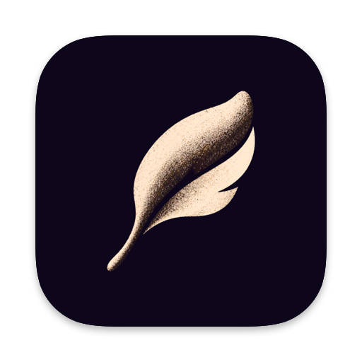
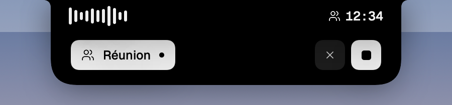
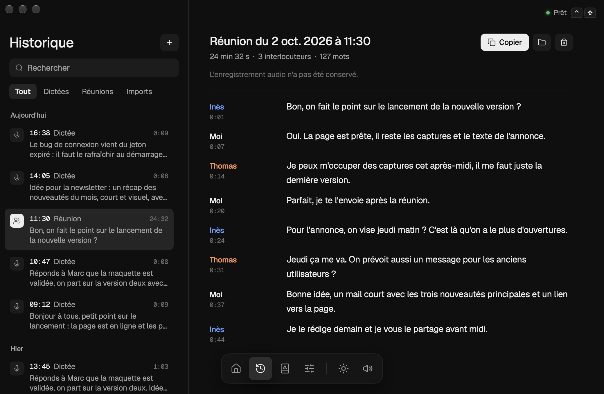

# Plume

**Tu parles, ça s'écrit.** Dictée vocale et transcription de réunions pour Mac. 
Gratuit, open source, et 100 % sur ton Mac.

### [⬇︎ Télécharger Plume](https://github.com/soyAkil/plume/releases/latest/download/Plume.dmg)

Mac M1 ou plus récent · macOS 15 ou plus récent · se met à jour tout seul

 

## Pourquoi Plume

- ⚡️ **Rapide** : 5 minutes de voix transcrites en moins de 2 secondes.
- 🔒 **Privé** : tout tourne sur ton Mac. Rien n'est envoyé nulle part, aucun compte.
- 🎙️ **Réunions** : Plume écoute ton micro *et* le son de l'ordi (Meet, Zoom, Teams…), puis
  sépare qui a dit quoi.
- ✍️ **En direct** : les mots apparaissent dans l'encoche pendant que tu parles.
- 🪶 **Léger** : il vit dans l'encoche et la barre de menus, et ne se montre que quand tu parles.
- 🤖 **Prêt pour l'IA** : tes transcriptions sont des fichiers texte, lisibles par Claude, ChatGPT
  et compagnie (dossier, ligne de commande, serveur MCP).

  

## Installer

1. [Télécharge Plume](https://github.com/soyAkil/plume/releases/latest/download/Plume.dmg) et glisse-le dans **Applications**.
2. La première fois, macOS le bloque (l'app n'est pas encore validée par Apple) : ouvre
   **Réglages Système › Confidentialité et sécurité**, puis **« Ouvrir quand même »**.
3. Autorise le micro (et l'accessibilité, pour que Plume colle le texte), et c'est parti. Le modèle de transcription (~600 Mo) se télécharge une
   seule fois.

## Utiliser

| | |
|---|---|
| `⌃` `⇧` | Lance la dictée. Encore `⌃` `⇧` : le texte se colle là où est ton curseur. |
| `⌃` `⇧` maintenus | Parle tant que tu tiens, lâche pour coller. |
| `⌃` `⇧` `⌘` | Lance une réunion. |
| `Échap` | Annule. |

Tout se règle dans la fenêtre de Plume (clic sur la plume dans la barre de menus) : raccourcis,
micro, sons, modèle. Le détail est dans le [guide](docs/GUIDE.md).

## Contribuer

Plume est jeune et toute aide est la bienvenue : bugs, idées, code, traductions.
Commence par [CONTRIBUTING.md](CONTRIBUTING.md), puis [docs/DEVELOPPEMENT.md](docs/DEVELOPPEMENT.md)
pour compiler en deux commandes (pas besoin de Xcode).

Pistes ouvertes : une app iPhone, d'autres modèles, de nouveaux packs de sons. Voir la
[feuille de route](docs/PLAN.md).

## Licence

Code sous licence [MIT](LICENSE). Polices, icônes, modèles et sons : voir
[Resources/LICENCES.md](Resources/LICENCES.md).
