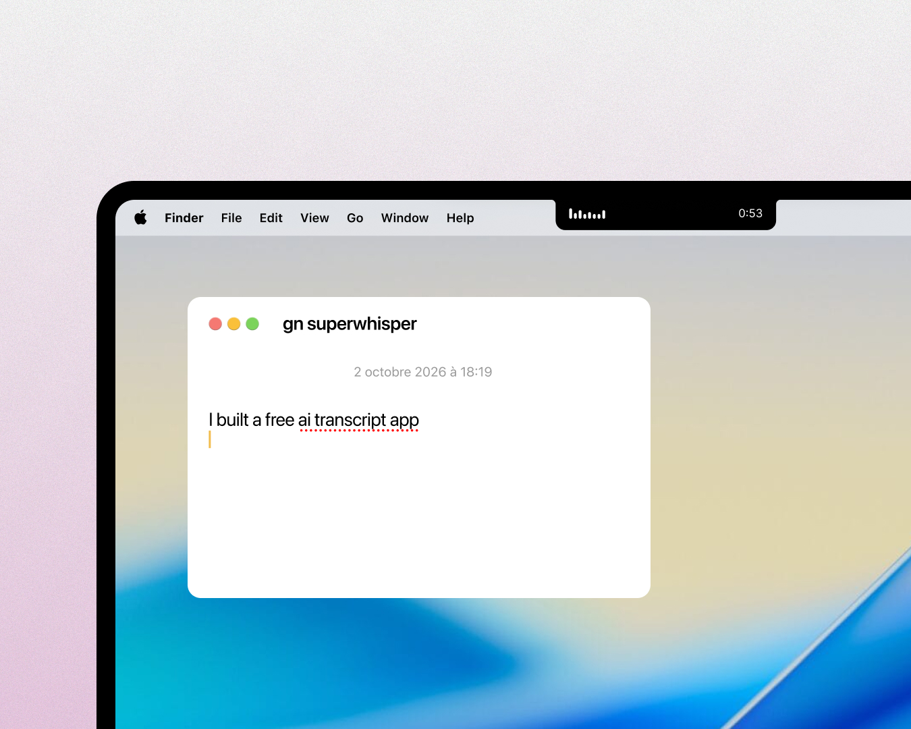

# Plume

Voice dictation and meeting transcription for the Mac. Free, open source, and entirely on your machine.



**[Download for macOS →](https://github.com/soyAkil/plume/releases/latest/download/Plume.dmg)** · Apple Silicon · macOS 15 or later · free · about 12 MB, plus a 600 MB speech model fetched once

Or build it yourself in two commands, without Xcode — see [For developers](#for-developers).

---

## What it is

Plume is dictation with nothing in the way. Press `⌃⇧`, talk, press `⌃⇧` again: the text lands where your cursor is. During a meeting it listens to your microphone *and* to the sound of the computer, then writes down who said what. The words can appear in the notch while you speak, and the app lives there and in the menu bar, showing itself only when you are talking.

Everything happens on the Mac. The speech model runs on the Neural Engine — Parakeet Ultra, a 2026 retraining of NVIDIA's Parakeet TDT, converted to Core ML by [Fluid Inference](https://github.com/FluidInference/FluidAudio) — and turns five minutes of speech into text in under two seconds. Speaker separation and echo cancellation are local too. There is no account, no subscription, and nothing to send anywhere.

It started as a free alternative to Superwhisper, designed around what people actually complain about in dictation apps: modes to configure before you can talk, an AI that quietly rewrites your numbers, a subscription for work the Mac does itself. Here the raw transcript is always kept, and there is nothing to choose before you speak.

## What it does

- **One shortcut.** `⌃⇧` starts a dictation; `⌃⇧` again pastes it into the active field. Hold the keys instead and Plume listens for as long as you hold them, then pastes when you let go. `esc` cancels. Hover the notch for meeting, cancel and done.
- **Meetings, both sides.** `⌃⇧⌘`, or the Meeting button on the island in the middle of a dictation. Plume records your microphone and the computer's audio (Meet, Zoom, Teams, FaceTime, anything that makes sound), separates the voices once the recording ends, labels yours "Me" from a voiceprint it learns on your own dictations, and files the dialogue in the history instead of pasting it. No headset? The speakers leak back into the mic; Plume detects that echo and removes it before transcribing, so the other side isn't written down twice. Click a name to rename it everywhere, click a timestamp to listen from there, or redo the voice separation with the number of people who spoke.
- **Live.** Optionally, the text appears in the notch as you talk, from the same model that produces the final result, so what you see is what you get.
- **Vocabulary.** Replacements for names and jargon, applied after a light clean-up of hesitations and stutters.
- **A history that is a folder.** Every transcription is a Markdown file, a JSON file and the audio, in `~/Plume`, one folder per month. Search it in the window or with `grep`. Drop an audio file on the window to transcribe it. Keeping the audio is a switch; the text stays.
- **Made for agents.** `plume last`, `plume search budget`, `plume transcribe meeting.m4a`. An MCP server, wired into Claude Code or Claude Desktop from Settings in one click. `plume toggle dictee`, `plume stop` and friends drive the app from a script, Raycast or a Stream Deck.
- **The clipboard is yours.** It is restored after every paste, and the dictation is marked transient so clipboard managers don't keep it.
- **Light.** The island in the notch and one window: home, history, vocabulary, settings. A sound at the start and end of each recording, with a few packs to choose from. If the app quits during a meeting, the audio is already on disk and is transcribed at the next launch.
- **Updates itself, quietly.** It checks the GitHub release feed for a newer build, verifies the signature, and installs it for the next launch.

<p align="center">
  
</p>

The interface is in French for now; the model handles 25 European languages.

## On the roadmap

Not in the app yet. Details and longer-term plans are in [docs/PLAN.md](docs/PLAN.md) (French).

- **Pause.** A pause on the island that really closes the microphone, the gap filled in when you resume.
- **Voice commands.** "new line", "new paragraph", "bullet point", "scratch that", "press enter", in French and English, applied on the finished text.
- **A rule per app.** A style per application (*Standard*, *Message*, *Casual*), send with Return, type instead of pasting for apps that refuse `⌘V`.
- **Text that fits where it lands.** Read around the cursor to add a space, drop a capital or a final period as needed.
- **It notices the call.** Offer to record when a call app takes the microphone.
- **Local AI, if you ask.** With Apple Intelligence: clean-up, meeting summaries, rewriting a selection on instruction. Off by default; the raw transcript always kept.
- **More from the history.** Titles, export to Markdown, plain text, SRT, WebVTT or JSON, audio kept 90, 30 or 7 days.
- **Voice snippets.** A vocabulary entry spanning several lines: say "my signature", get your signature.
- **More for agents.** An MCP `listen` tool (the agent opens the mic, you answer out loud), and `plume://` links for Shortcuts.
- **Translations** of the interface, an iOS app on the same engine, acoustic vocabulary for proper nouns, notarization.

## What it doesn't do

On purpose:

- No account, no subscription, no cloud. The models run on the Neural Engine. There is nothing to sign in to and nothing to pay for.
- No AI rewriting. The text you get is what you said, after a deterministic pass (clean-up, vocabulary), and the raw transcript is always kept.
- No modes. One shortcut, nothing to choose before you speak.
- No telemetry, no analytics, no crash reports. The only things that leave your Mac are one model download from Hugging Face, the first time, and one small request to GitHub to see whether there is a newer version.
- No Intel, no Windows. Apple Silicon and macOS 15 or later.

## Privacy, concretely

| What | Where it is | Who can read it |
|---|---|---|
| Transcriptions and audio | `~/Plume/`: Markdown, JSON and `.m4a` files, one folder per month, plus `dernier.md` (the latest) and `index.jsonl` | You, `grep`, and any app or AI you point at the folder. |
| Settings and vocabulary | macOS defaults under `studio.brigode.plume`, and small files in `~/Library/Application Support/Plume/` | You. |
| Your voiceprint | One JSON file in that same folder | Plume, to label "Me" in meetings. |
| Speech models | `~/Library/Application Support/FluidAudio/Models/`, about 600 MB, downloaded once | — |
| The log | `~/Library/Logs/Plume/plume.log`. It can contain excerpts of your dictations: read it before attaching it to an issue. | You. |
| Anything else | Nowhere. There is no server. | — |

Three permissions, each asked when first needed: **Microphone** (to hear you), **Accessibility** (to press `⌘V` for you; without it the text is only copied), **System audio recording** (for the other side of a meeting). The app is signed with a stable certificate, so the permissions survive updates.

During a meeting, audio is written to disk as it is recorded. Delete a transcription from the history and its text and audio go to the Trash together.

## Keyboard

| | |
|---|---|
| `⌃⇧` start · `⌃⇧` again paste · hold `⌃⇧` talk while held · `⌃⇧⌘` meeting · `esc` cancel | Hover the notch: meeting, cancel, done |
| In the window: `1`–`4` home, history, vocabulary, settings · `T` light or dark · `S` sounds | A third, unassigned by default: open the window |

Shortcuts are changed in Settings. A shortcut can be a chord of modifiers alone (`⌃⇧`) or a key with modifiers (`⌥Space`). A chord only fires when it is "clean": `⌃⇧Tab` or `⌃⇧` + click do nothing.

The full tour of settings — microphone, sounds, model, library — is in the [guide](docs/GUIDE.md) (French).

---

## For developers

### Why the source is here

So anyone can read exactly what an app that hears everything you say does with it, build it themselves, or fix what bothers them. It is about 10,000 lines of Swift, two dependencies (FluidAudio for the models, Sparkle for updates), one file per concern, and no Xcode project.

### Building it

- An Apple Silicon Mac, macOS 15 or later, and the Command Line Tools (Swift 6). Xcode is not needed.
- `swift build -c release` — compiles the app and the `plume` command.
- `./scripts/build.sh` — assembles a double-clickable `build/Plume.app`, signed with a local certificate kept in its own keychain so macOS permissions survive rebuilds. `./scripts/build.sh --install` puts it in `/Applications`, links `plume` into `~/.local/bin` and relaunches it.
- `./scripts/test.sh` — the tests (Swift Testing; the script finds the framework without Xcode). The same compile-and-test runs on every pull request.

A build you make yourself is not notarized, so the first launch needs an allow in System Settings › Privacy & Security. Published releases aren't notarized yet either — that needs an Apple Developer account and is on the list — so they get the same one-time "Open Anyway". `./scripts/release.sh <version>` makes the signed `.dmg` and the update feed; `publish.sh` uploads them. Those only matter for the project's own releases; see [docs/PUBLIER.md](docs/PUBLIER.md) (French).

### How it's put together

- **Two targets.** `PlumeKit` is the core with no interface — engine, pipeline, formatting, library, settings — and is what the tests cover; it is kept separate so an iOS app can reuse it. `Plume` is the Mac app: the island, the window, hotkeys, audio capture, sounds, the CLI, the MCP server, updates.
- **The engine** (`Engine.swift`) is FluidAudio on Core ML: Parakeet Ultra for words, pyannote community-1 for voices, both on the Neural Engine. The original Parakeet TDT v3 is there too, selectable in Settings.
- **Live text** (`LiveTranscriber.swift`) re-transcribes a sliding window about twice a second with the same model as the final pass, for 6–7 % of real time. Validated text freezes at sentence ends.
- **Voices** are separated offline, at the end, per channel: the microphone and the system audio are diarized separately and merged by timestamp, which is more reliable than streaming diarization. Speaker changes are snapped to the nearest pause or sentence end, and voices that merely sound alike are never merged. "Me" is a voiceprint learned on dictations, which by definition contain only your voice.
- **The formatting** is deterministic: a light clean-up of hesitations and stutters, then the vocabulary (`TextCleanup`, `Replacements`).
- **System audio** comes from a Core Audio process tap, which needs the "system audio" permission and not screen recording. Echo cancellation is LocalVQE, a neural model, applied to the mic with the system audio as reference and only when echo is actually detected.
- **Hotkeys**: the modifier chord is read by polling the keyboard state, so it needs no special permission, and it doesn't fire on `⌃⇧` + key. Quit Superwhisper if you run both, they share `⌃⇧`.
- **Pasting** (`Paster.swift`) puts the text on the clipboard, simulates `⌘V` (which is what the Accessibility permission is for), then restores the previous clipboard unless you copied something in between.
- **The library** (`Library.swift`) is a folder of Markdown and JSON, not a database. `Recovery.swift` transcribes whatever was being recorded when the app last stopped.
- **The look** is in `Design.swift` — colours as light/dark pairs, Geist and Geist Mono — and `Icons.swift` (Lucide, drawn from SVG paths). Sounds are synthesised in `Sounds.swift` or come from the recorded packs in `Resources/Sounds`.
- `Sources/Plume/` is one file per concern: `Island.swift` is the notch, `Hotkeys.swift` the shortcuts, `MCPServer.swift` and `CLI.swift` the agent side, `Updates.swift` the update. The full map is in [docs/DEVELOPPEMENT.md](docs/DEVELOPPEMENT.md) (French).

### Testing it without a microphone

Environment variables replay files in place of the real inputs, on a command channel separate from the installed app, with their own library:

```sh
export PLUME_LIBRARY=/tmp/trial PLUME_CHANNEL=trial PLUME_HEADLESS=1   # invisible, no hotkeys
PLUME_FAKE_MIC=me.wav PLUME_FAKE_SYSTEM=them.wav PLUME_NO_PASTE=1 PLUME_VERBOSE=1 .build/release/Plume &
.build/release/Plume toggle dictee     # start
.build/release/Plume toggle reunion    # switch to meeting
.build/release/Plume stop
```

A development binary shares the settings and vocabulary of the installed app: a change made during a trial shows up in your real Plume.

`plume doctor` reports permissions, model and screens. `plume transcribe mic.wav --system computer.wav` runs a two-channel meeting from files; `plume diarize file.wav` shows the voices it finds; `plume render <folder> --demo` draws the whole interface off-screen with an invented library, which is how the screenshots above were made. Test dictations come from the Mac's own speech synthesis: `say -v Jacques -o d.aiff "Bonjour, ceci est un essai."`, then `afconvert -f WAVE -d LEI16@16000 -c 1 d.aiff d.wav`.

### Contributing

Issues and pull requests are welcome — bugs, ideas, code, translations. [CONTRIBUTING.md](CONTRIBUTING.md) says how things are reviewed; the short version: small changes, no new dependency without an issue first, nothing that phones home, and a screenshot or a short video when the interface changes. Code, comments and the interface are in French; match the file you are in.

What's next: [On the roadmap](#on-the-roadmap) above, and [docs/PLAN.md](docs/PLAN.md).

### License

MIT — see [LICENSE](LICENSE). Do what you want with the code. The models, fonts, icons and sound packs have their own licenses (CC BY 4.0, Apache 2.0, OFL, ISC), listed with their authors in [Resources/LICENCES.md](Resources/LICENCES.md). Please give a fork its own name and icon before distributing it.
